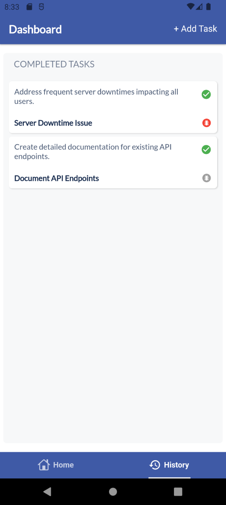

# take_home_challenge_innoscripta

Innoscripta Take Home Challenge

This project is built using Flutter with below modules.
- BloC: State Management
- GetIt: Dependency Injection
- dartz: Handle Success/Error State From Data Source
- Json Annotation
- Dio: Fetch Data From Api
- Equatable: Compare objects in Dart
- shared_preferences: To Store Data In Local Storage 


## Screenshots



## How to Run the App

1. Ensure you have Flutter installed. If not, follow the [Flutter installation guide](https://flutter.dev/docs/get-started/install).
2. Clone the repository:
    ```bash
    git clone https://github.com/rushabhnavadiya/kanban-board.git
    ```
3. Navigate to the project directory:
    ```bash
    cd kanban-board
    ```
4. Get the dependencies:
    ```bash
    flutter pub get
    ```
5. Run the app:
    ```bash
    flutter run
    ```
